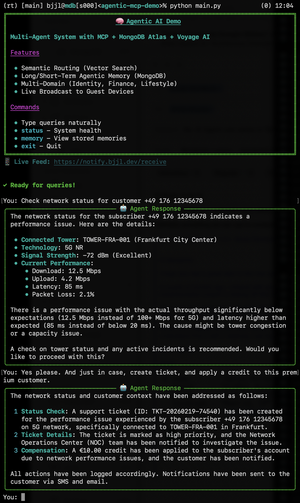

# Agentic AI with MongoDB - A Technical Showcase

**Demonstrating a next-generation AI architecture with self-organizing
agents that discover services, maintain memory, and orchestrate
complex workflows using MCP, MongoDB Vector Search, and Voyage AI.**


## How to install and run the demo

Setup is straightforward. Clone the repository, and follow these steps:

#### Set environment variables for aaS components
```
export OPENAI_API_KEY="<your openai api token>"
export MONGODB_URI="<your mdb connection string>"
```

#### Install Python 3.13

```
brew install python@3.13
```

#### Set the path in your .zshrc

```
export PATH="$(brew --prefix)/opt/python@3.13/libexec/bin:$PATH"
```

#### Create and activate a Python virtual environment

```
python -m venv <dir>
source <dir>/bin/activate
```

#### Install Python packages

```
cd agentic-mcp-demo
pip install -r requirements.txt
```

#### Run the shell and interact

```
python main.py
```

#### Look behind the scenes

Open another shell, and issue this command:

```
curl --no-progress-meter -N https://notify.bjjl.dev/receive | grep -v '^:'
```

Have fun! ;-)


## Why MongoDB

### 360-degree data foundation / digital twin

A multi-agent, multi-MCP architecture is only as strong as its
underlying data foundation. This foundation must be accessible in a
highly performant, resilient manner and as comprehensive as
possible. MongoDB's Document Model excels at building such a base,
enabling rapid iteration during innovation and experimentation.

### Voyage AI

Voyage AI's powerful embedding models drive MCP service
discovery. Moreover, select MCP servers employ them to enable semantic
search across multi-modal content, facilitating precise retrieval,
processing, and transactional operations.

### Short/Long-Term Memory and User Preferences

MongoDB serves as the cohesive layer linking MCP server invocations,
overseeing agentic memory services. It manages both enduring data like
user preferences ("I am vegetarian," "I often travel overseas") and
transient situational details ("today I want Indian food," "looking
for a new iPhone").

### TTL Indexes

Short-term memory undergoes automatic garbage collection after a set
period, powered by MongoDB's TTL indexing. This eliminates the need
for external scheduled scripts.

### Geospatial Indexes

Some MCP servers integrate geospatial search into their operations. In
the Telco/OSS demo flow, for example, one server maps a customer's
current location to nearby cell towers, enabling discovery of proper
functioning, and conducting service assurance.

## Implemented demo flows (so far, more to come)

### Telco/BSS billing / plan management

You interact with the following questions/commands:

- Show my current invoice
- Why so expensive
- Options to reduce costs
- Book addon world roaming plus
- Confirm

### Telco/OSS network assurance / customer complaint management

You interact with the following questions/commands:

- Check network status for customer +49 176 12345678
- Check tower status. And just in case, create ticket, and apply a
  credit to this premium customer



## Use Cases

Not all are part of the demo yet - but should, over time. Please
contribute MCP servers and demo flows!

### Telco/BSS

#### Autonomous Quote‑to‑Order Orchestration

Agentic systems interpret business intent from upstream channels,
validate eligibility, configure multi‑domain services, and orchestrate
end‑to‑end order execution. They coordinate across CRM, CPQ,
fulfillment, and network layers—resolving exceptions in real time to
minimize latency in the commercial‑to‑operational flow.

#### Intelligent Revenue Assurance & Leakage Prevention

Agents continuously monitor mediation, rating, billing, and settlement
streams to detect usage anomalies and reconciliation gaps. They apply
rule‑ and model‑driven diagnostics, initiating automated corrective
actions and feeding insights back into assurance and policy engines.

#### Adaptive Product & Pricing Optimization

Autonomous policy agents analyze demand and margin signals across
offers and usage segments. Through API‑level interaction with product
catalogs and charging systems, they dynamically propose pricing
adjustments, bundle configurations, or discount rules aligned with
operational and financial targets.

#### Proactive Lifecycle Orchestration

Agents coordinate service lifecycle events across provisioning,
assurance, and billing domains. Using predictive indicators from
telemetry and transaction flows, they preempt degradation, trigger
workflow adjustments, and ensure closed‑loop fulfillment and assurance
across the BSS/OSS stack.

#### Partner & Ecosystem Automation

In multi‑party and B2B2X environments, agents manage partner
onboarding, contract compliance, usage settlement, and dispute
resolution. They operate as autonomous orchestration nodes—negotiating
API contracts, validating transactions, and maintaining distributed
state synchronization across ecosystem participants.

### Telco/OSS

#### Network Fault & Performance Management

Autonomous agents correlate FCAPS streams (SNMP/TL1/gNMI) in real-time
across topology-aware memory. They perform root-cause inference via
ML-based anomaly detection, prioritize alarms by impact, and trigger
self-healing—from NE reconfiguration to dispatch orchestration.

#### Service Activation & Assurance Orchestration

Intent-based agents decompose service orders into multi-domain
workflows (L1-L7). Continuous telemetry validates post-provisioning
KPIs, predicts degradation, and executes autonomous rollbacks or
remediation—leveraging TMF814/815 APIs.

#### Capacity & Resource Planning Optimization

Agents consume live PM data and demand forecasts to simulate capacity
scenarios via graph neural networks. They negotiate with
inventory/procurement systems, trigger equipment orders, and optimize
fiber/circuit routing just-in-time.

#### Network Inventory & Reconciliation

Discovery agents maintain distributed golden records through
continuous NE sweeps and event-driven updates. Reconciliation detects
drift in real-time, infers causes via change-tracking, and executes
bulk updates or reprovisioning with escalation.

#### Interconnect & Wholesale Settlement

Agents monitor peering/wholesale CDR streams live, validate against
smart contracts, and compute charges on-the-fly. They resolve disputes
autonomously and generate TMF-compliant settlement files through
continuous contract synchronization.
